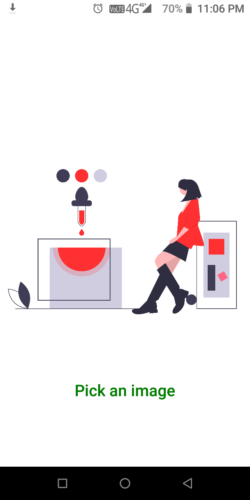
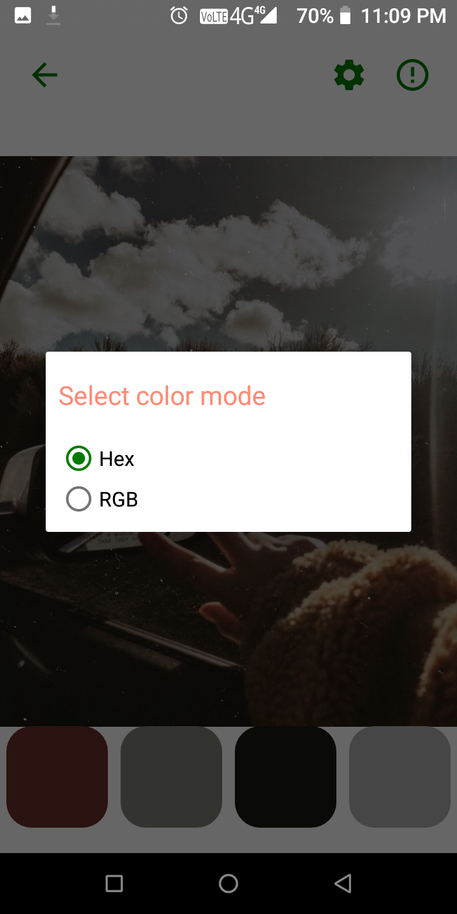
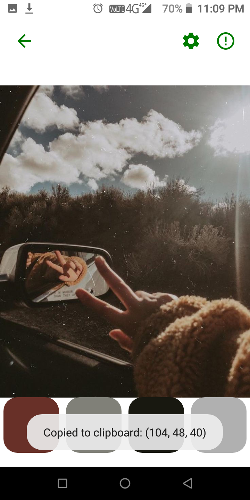
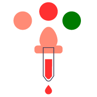

## **ColorPalettefromImage**
An android app that makes color-palette from choosen image. 
 * Copy particuar color code 
 * Supports RGB format 
 * Supports hex-code. 

## **Screenshot**
    

## **Video**

## **Icon**

